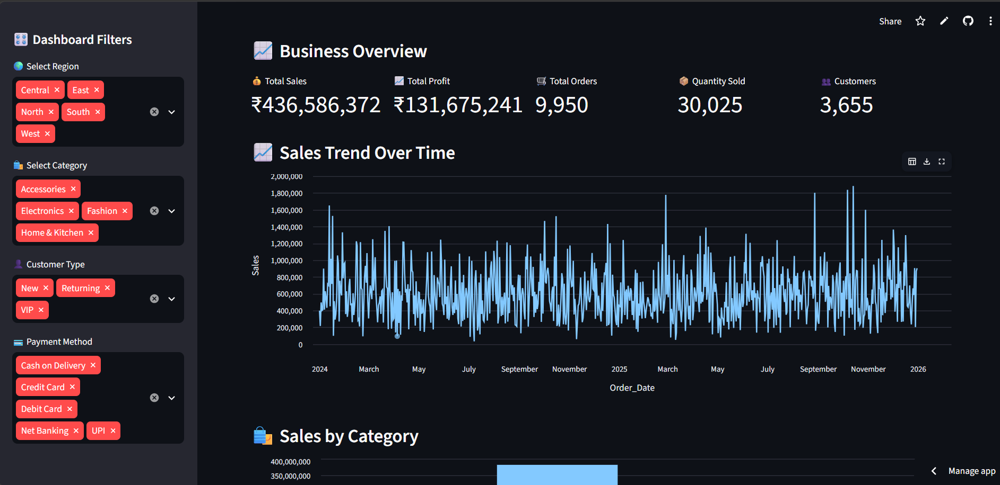
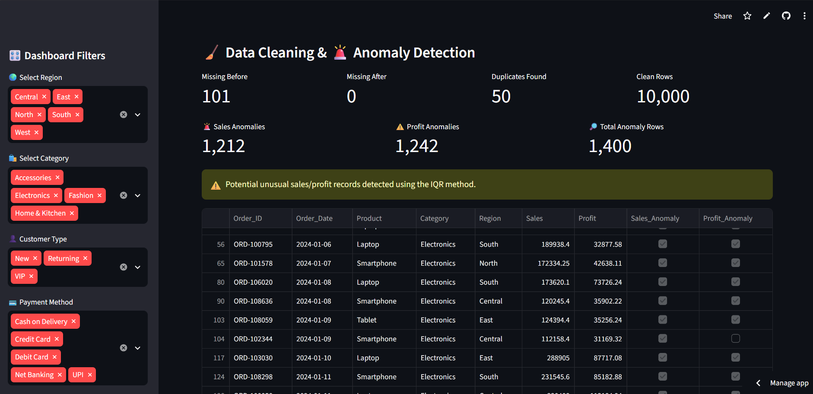
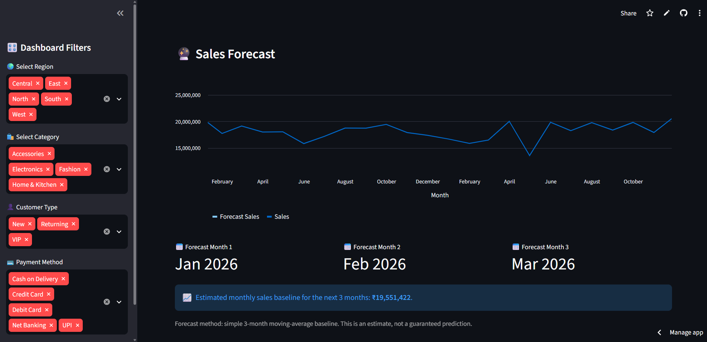

# 🤖 AI Analytics Copilot – Intelligent Data Assistant

[🚀 Live Demo](https://ai-analytics-copilot-cpwxvt2dpembwbzbzcv42q.streamlit.app/)

[📂 GitHub Repository](https://github.com/patujaware123/AI-Analytics-Copilot)

## 📌 Project Overview

AI Analytics Copilot is an AI-powered Data Analytics application that helps users explore datasets, identify business insights, detect anomalies, forecast sales, and ask questions using natural language.

The project combines **Python, Pandas, Streamlit, Data Analytics, Machine Learning techniques, and a local LLM (Llama 3.2)** to create an interactive Data Analyst assistant.

## 🚀 Key Features

- 📊 Interactive Business Dashboard
- 🔍 Data Filtering and Exploration
- 🧹 Automatic Data Cleaning
- 🚨 AI-Assisted Anomaly Detection
- 📈 Sales Forecasting
- 🤖 Natural Language AI Analyst
- 💡 Automatic Business Insights
- 📥 Cleaned Data Export
- 📄 Anomaly Report Export
- 📂 CSV and Excel File Upload

---

## 📊 Business Dashboard

The dashboard provides an overview of important business KPIs including:

- Total Sales
- Total Profit
- Total Orders
- Quantity Sold
- Total Customers



---

## 🔎 Interactive Filters

Users can filter the dataset based on:

- Region
- Category
- Customer Type
- Payment Method

The charts and KPIs automatically update according to the selected filters.

---

## 📈 Data Visualizations

The dashboard includes:

- Sales Trend Over Time
- Sales by Category
- Sales by Region
- Profit by Category
- Top 10 Products by Sales
- Monthly Sales & Profit

---

## 🚨 AI Anomaly Detection

The application automatically identifies unusual values in sales and profit data using the **IQR (Interquartile Range) method**.

It provides:

- Missing Values Before Cleaning
- Missing Values After Cleaning
- Duplicate Records
- Sales Anomalies
- Profit Anomalies
- Total Anomaly Records



---

## 📈 Sales Forecasting

The application provides a simple sales forecasting baseline using a **3-month moving average**.

The forecast helps users understand the expected sales trend for upcoming months.

> Note: Forecast values are estimates and should be used as a baseline for analysis rather than guaranteed future results.



---

## 🤖 AI Analyst

The AI Analyst allows users to ask questions about their dataset using natural language.

### Example Questions

```text
Which category has the highest sales?

Which region has the highest sales?

Which product has the highest sales?

Which category has the highest profit?

Show me the top 3 products by sales.

Which product has the lowest sales?

Compare Electronics and Fashion sales.

Give me 3 business recommendations based on the sales and profit data.

 Analyst](ai-analyst.png)
